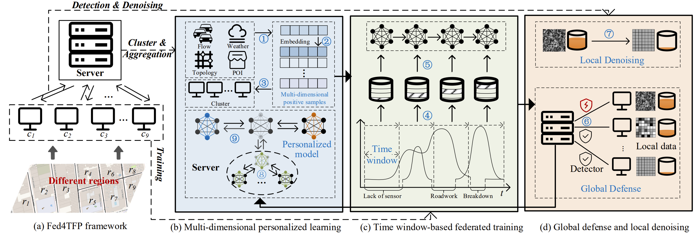

# Fed4TFP

In this paper, we perform the first study of heterogeneity-aware TFP within the FL framework, proposing a unified and
effective framework named Fed4TFP. It solves the data heterogeneity challenges of TFP in FL and offers general
federated extension capability for existing centralized TFP models. To address the traffic feature heterogeneity,
Fed4TFP employs multi-dimensional positive samples contrastive learning for clustering to achieve personalized FL
across diverse clients. To overcome the time coverage heterogeneity, Fed4TFP introduces a time window-based federated
training, sequentially training client models over different time windows and learning missing information with varying
time coverage. To tackle the data quality heterogeneity, Fed4TFP incorporates a dual-driven method, employing
global-defense and local-denoising approaches to improve federated client data quality. Experiments on three benchmark
datasets demonstrate that Fed4TFP significantly outperforms state-of-the-art baselines, e.g., 5.47%–38.48% improvement.

## Dependency

FederatedScope.version = 0.3.0 
Python.version = 3.9.18 
Cuda.version = 11.3 
Xlrd.version = 2.0.1 

## Environment

All the experiments are conducted in the federated environment on seven nodes, one as a server and the other six as
clients, each equipped with two Intel(R) Xeon(R) CPU E5-2650 v4@2.20GHz 12-core processors, 128GB of RAM, and an
internet speed of 100MB/s.

## Dataset

The datasets used can be downloaded in the paper.

## Complication

The running example of Fed4TFP is as follows: 
python main.py --cfg federatedscope/contrib/configs/pems04.yaml
